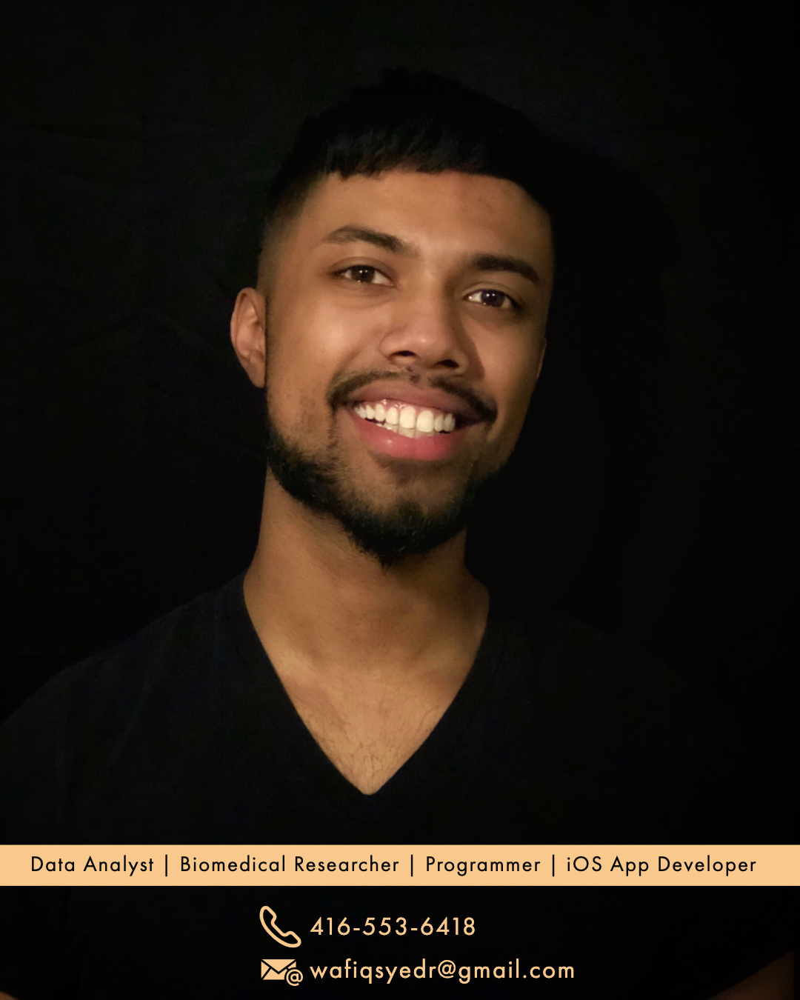

# AboutMe
Versatile data analyst, biomedical engineering researcher, and computer programmer specializing in automation using data-driven methods. 

Email: wafiqsyedr@gmail.com 

Resume: https://github.com/wafiqsyed/AboutMe/blob/master/WafiqSyedResume.pdf

## Education: 
**Bachelor of Science (BSc) - Medical Science & Computer Science** 

**Univeristy of Western Ontario (UWO)**

###  Professional Passions: 
#### Biomedical Engineering Research - Python (certified), Java, C, Bash, R
Currently, at the London Health Sciences Centre, I'm one of the lead developers on a Python application called DBSGuide that can be incorporated into 3D MRI Slicer (a medical visualization software) to accurately visualize the brain target area for Parkinson's patients undergoing Deep Brain Stimulation (neurosurgery). Check out our work on our ReadTheDocs website: 

#### Data/Marketing Analytics: Excel - VBA/Macros, SQL, Tableau, Mircorsoft Access & Power BI
*Everything can be improved by automation.* The key is to identify what to automate. This is where my fascination with data analytics stems from. Data is the key to opportunity I enjoy exploring the question: how can we translate this data into optimizing processes with the aid of computer programming algorithms?
#### iOS App Development (Swift/XCode)
I have a great passion for app development. Frameworks such as Augmented Reality bring an entire new world of possibilities.
Here are some of the apps I've developed:

Apple-Pie (Hangman): https://github.com/wafiqsyed/Apple-Pie

Calculator: https://github.com/wafiqsyed/Calculator-App-iOS

Thanks for having a read! I welcome new opportunities and projects. Please email me at wafiqsyedr@gmail.com

